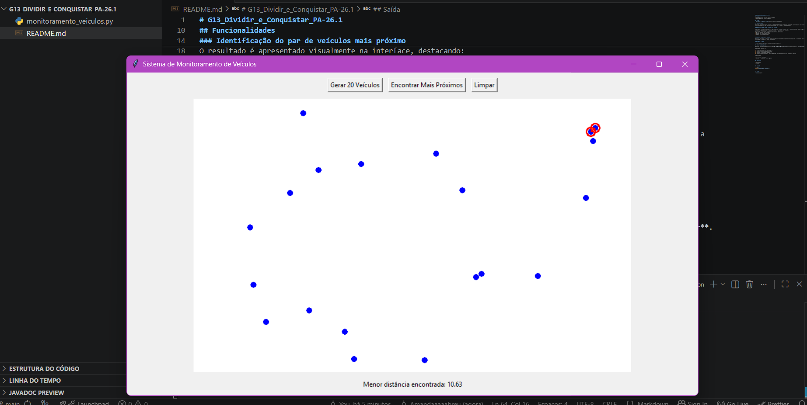

# G13_Dividir_e_Conquistar_PA-26.1

## Alunos
- Amanda Gonçalves Sobrinho Abreu (211030925)
- Arthur Rodrigues Sousa (211030291)

## Vídeo
 [Apresentação Amanda e Arthur](https://youtu.be/ef7WdkGWxZ4)

## Funcionalidades

O sistema permite adicionar veículos em um mapa bidimensional por meio de cliques do usuário ou pela geração automática de posições aleatórias. Cada veículo é representado por um ponto na interface gráfica.

### Identificação do par de veículos mais próximo

A aplicação utiliza o algoritmo **Par de Pontos Mais Próximos (Closest Pair of Points)** baseado na estratégia de **Dividir e Conquistar** para encontrar os dois veículos com a menor distância entre si.

O resultado é apresentado visualmente na interface, destacando:
- Os dois veículos mais próximos;
- A linha que conecta os veículos;
- A menor distância encontrada.


### Geração automática de veículos

O usuário pode gerar um conjunto de veículos em posições aleatórias para testar o algoritmo em diferentes cenários sem a necessidade de inserir os pontos manualmente.

### Limpeza do mapa

Permite remover todos os veículos e reiniciar a simulação.

## Descrição do Algoritmo

O projeto resolve o problema clássico do **Par de Pontos Mais Próximos** utilizando a técnica de **Dividir e Conquistar**.

A abordagem consiste em:

1. Ordenar os pontos pela coordenada X;
2. Dividir o conjunto em duas metades;
3. Resolver recursivamente cada metade;
4. Comparar os resultados obtidos;
5. Verificar pontos próximos à região de divisão para encontrar possíveis pares mais próximos.

Complexidade:

- Força Bruta: **O(n²)**
- Dividir e Conquistar: **O(n log n)**


## Requisitos

- Python 3.x
- Tkinter


## Execução

```bash
python monitoramento_veiculos.py.
```

## Saída


